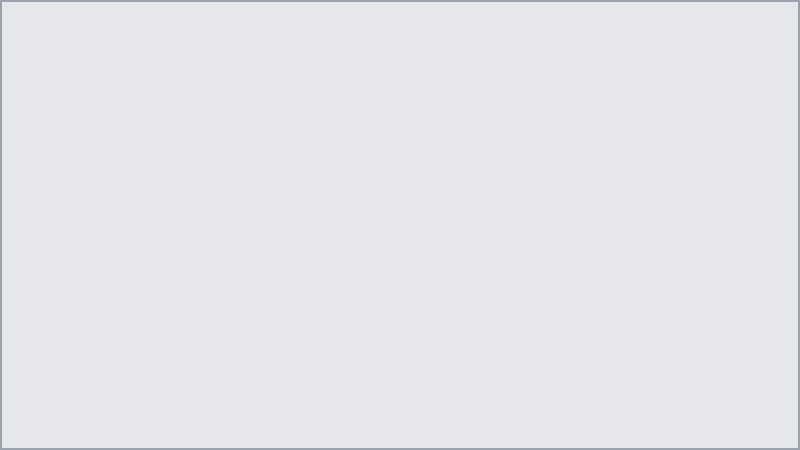
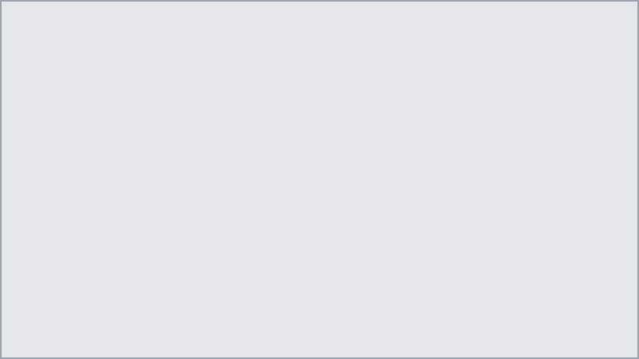
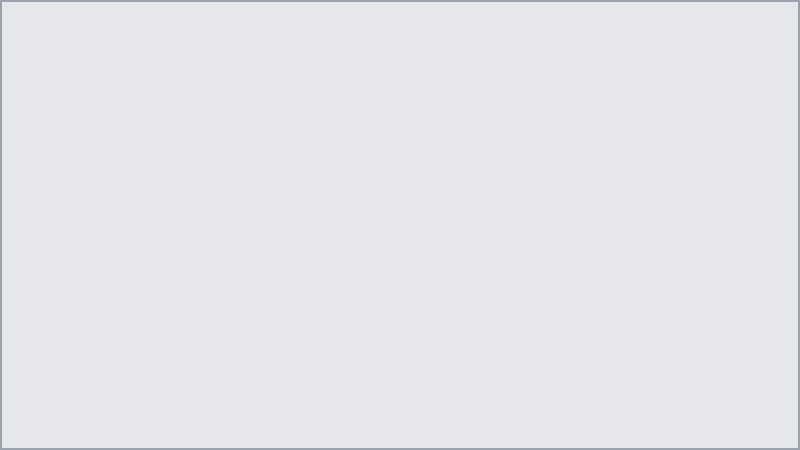

# StepUp — AI Learning Plan

> Aplikasi web yang membantu peserta bootcamp merencanakan dan menjalani belajar secara konsisten, dengan bantuan AI sebagai *learning coach*.


---

## Fitur Utama

### 🔐 Autentikasi & Social Login

Masuk dengan email/password atau Google OAuth. Refresh token rotation untuk keamanan tanpa gesekan.


---

### 🤖 AI Learning Coach

Coach AI yang merespon konteks belajar kamu — menyarankan tugas, menyesuaikan jadwal, dan memberikan strategi belajar yang relevan.



---

### 📋 Buat Rencana Belajar

Tentukan goal, deadline, jam belajar mingguan, dan preferensi waktu. AI akan memecah goal menjadi task-task kecil (25–90 menit) yang spesifik.


---

### 📅 Jadwal Belajar Adaptif

Task dijadwalkan di slot Pagi/Siang/Malam berdasarkan ketersediaan kamu. Streak badge, filter hari/minggu, dan quick actions untuk menyesuaikan beban.


---

### 📈 Progress Analytics

Progress ring, distribusi task per tipe (acquire, practice, recall, dll.), completion rate, dan strategi dari AI Coach berdasarkan performa kamu.



---

### ✋ Human-in-the-Loop

Setiap saran AI bersifat opsional — kamu lihat dulu, setujui atau tolak sebelum perubahan diterapkan. Tidak ada perubahan otomatis tanpa persetujuan.



---

## Quick Start

```bash
git clone <repository-url>
cd ai-learning-plan
cp server/.env.example server/.env
# Isi GEMINI_API_KEY di server/.env

docker compose up db -d
cd server && npm install && npm run migrate:up && npm run dev

# Terminal lain:
cd client && npm install && npm run dev
```

- Frontend: http://localhost:5173
- Backend: http://localhost:3000
- Health: http://localhost:3000/health

> **Butuh panduan lengkap?** Lihat [Getting Started Guide](docs/guides/Getting%20Started.md).

---

## Dokumentasi

| Dokumen | Deskripsi |
|---------|-----------|
| [Problem Framing](docs/problem-framing.md) | Latar belakang dan pendekatan |
| [Architecture Decision Records](docs/adr/) | Keputusan arsitektur (tech stack, state management, multi-provider LLM, dll.) |
| [Testing Guide](docs/guides/Testing%20Guide.md) | Cara menjalankan dan menulis test |
| [Deployment Guide](docs/guides/Deployment%20Guide.md) | Deploy ke VPS, Vercel, Railway |
| [Extension Guide](docs/guides/Extension%20Guide.md) | Menambah fitur, endpoint, halaman baru |
| [Best Practices & Pitfalls](docs/guides/Best%20Practices%20%26%20Pitfalls.md) | Panduan coding patterns |
