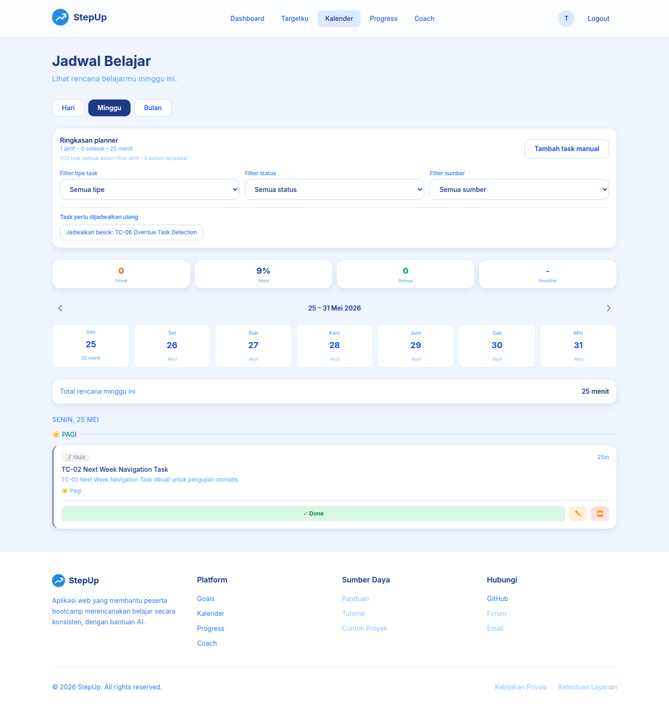
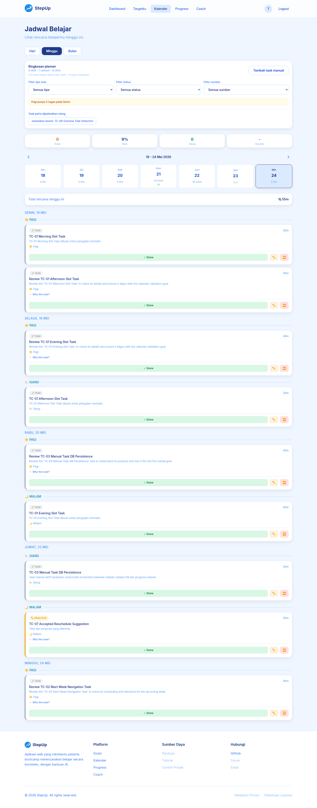

# README Test TC-01 sampai TC-07: Kalender, Task, dan AI

Dokumen ini berisi hasil pengujian fitur kalender, navigasi minggu, manajemen task, progress snapshot, overdue detection, dan flow AI reschedule.

Generated: 2026-05-24T09:33:39.631Z

## Setup Guide

1. Jalankan database dan Redis.

```bash
docker compose up db redis -d
```

2. Jalankan backend dengan konfigurasi lokal.

```bash
cd server
npm install
npm run migrate:up
npm run dev
```

3. Jalankan frontend.

```bash
cd client
npm install
npm run dev
```

4. Jalankan automated test dan screenshot.

```bash
node scripts/run-calendar-task-ai-tc01-tc07.js
```

Environment yang dipakai script:

| Variable | Default |
| --- | --- |
| `API_BASE_URL` | `http://localhost:3000/api` |
| `APP_BASE_URL` | `http://localhost:5173` |
| `CHROME_PATH` | `/usr/bin/chromium-browser` |

## Before Test

| Area | Kondisi Awal |
| --- | --- |
| Data testing | Script membuat user testing baru dengan prefix `tc01-tc07-ui-` agar tidak mengganggu data utama. |
| Goal | Goal sementara dibuat khusus untuk test TC-01 sampai TC-07. |
| Kalender | Task slot pagi, siang, malam, dan task minggu depan dibuat agar navigasi bisa diuji. |
| AI recommendation | Belum ada recommendation sebelum TC-04 berjalan. |
| Progress | Belum ada progress snapshot untuk task manual TC-05. |
| Overdue | Belum ada task overdue sebelum TC-06 berjalan. |

## Summary

| Status | Count |
| --- | ---: |
| PASS | 13 |
| WARN | 0 |
| FAIL | 0 |

## Hasil Pengujian

| TC | Status | Pengujian | Evidence | Screenshot |
| --- | --- | --- | --- | --- |
| SETUP | PASS | Membuat user, goal, dan data kalender sementara | User tc01-tc07-ui-1779615186214@example.com, goal b121a82e-a661-40e5-9831-7c54cf565846. | - |
| TC-03 | PASS | Membuat tugas manual dan memastikan data tersimpan di database | Task 9e2dc3de-4dd7-4763-8d83-d8e034508a99 tersimpan dan terbaca ulang via API dengan source=manual. | - |
| TC-04 | PASS | Membuat tugas berdasarkan rekomendasi/saran AI | Recommendation ded63bd0-a721-4a0e-858b-332777e5d34b diterima dan 5 task AI tersimpan. | - |
| TC-05 | PASS | Mengubah status todo ke done dan memvalidasi progress snapshot | Task 9e2dc3de-4dd7-4763-8d83-d8e034508a99 menjadi done; progress 2026-W21 completed_hours=0.7. | - |
| TC-06 | PASS | Memastikan sistem mendeteksi tugas yang melewati tenggat waktu | Task 14edb069-32a1-4f56-a096-8de134f50e4d terdeteksi overdue karena planned_date=2026-05-22T17:00:00.000Z. | - |
| TC-07 | PASS | Reschedule otomatis via AI untuk overdue, lalu Accept dan Reject saran | Overdue task dipindah ke 2026-05-24T17:00:00.000Z; Accept membuat 1 task. Reject 6ec2c836-1641-4527-859b-e661ef02494b berhasil; tidak ada task baru. | - |
| TC-01 | PASS | Tugas muncul di slot waktu kalender mingguan sesuai timestamp | Task pagi, siang, dan malam tampil di tampilan minggu sesuai planned_date/planned_slot. | [lihat screenshot](assets/images/tc01-tc07-calendar-task-ai/01-tc01-weekly-slots.png) |
| TC-02 | PASS | Navigasi minggu Next/Previous memuat data yang benar | Minggu berikutnya menampilkan task TC-02, lalu minggu sebelumnya kembali menampilkan task TC-01. | [lihat screenshot](assets/images/tc01-tc07-calendar-task-ai/02-tc02-next-week.png)<br>[lihat screenshot](assets/images/tc01-tc07-calendar-task-ai/03-tc02-previous-week.png) |
| TC-03-UI | PASS | Bukti UI task manual | Task manual TC-03 terlihat pada kalender. | [lihat screenshot](assets/images/tc01-tc07-calendar-task-ai/04-tc03-manual-task.png) |
| TC-04-UI | PASS | Bukti UI task dari AI | Task dari sumber AI terlihat pada kalender. | [lihat screenshot](assets/images/tc01-tc07-calendar-task-ai/05-tc04-ai-task.png) |
| TC-05-UI | PASS | Bukti UI progress setelah task selesai | Halaman progress berhasil dimuat setelah task TC-03 diubah menjadi done. | [lihat screenshot](assets/images/tc01-tc07-calendar-task-ai/06-tc05-progress-snapshot.png) |
| TC-06-UI | PASS | Bukti UI setelah data overdue dibuat | Kalender dimuat setelah overdue task dibuat; status overdue utama divalidasi melalui data API. | [lihat screenshot](assets/images/tc01-tc07-calendar-task-ai/07-tc06-overdue-data.png) |
| TC-07-UI | PASS | Bukti UI setelah flow reschedule, accept, dan reject | Kalender dimuat setelah reschedule/accept/reject selesai; perubahan utama divalidasi melalui API. | [lihat screenshot](assets/images/tc01-tc07-calendar-task-ai/08-tc07-reschedule-accept-reject.png) |

## Screenshot Step by Step

### 1. TC-01 weekly slot timestamp


### 2. TC-02 next week navigation



### 3. TC-02 previous week navigation



### 4. TC-03 manual task visible


### 5. TC-04 AI task visible


### 6. TC-05 progress page


### 7. TC-06 overdue evidence


### 8. TC-07 reschedule accept reject evidence


## After Test

| Area | Kondisi Setelah Test |
| --- | --- |
| TC-01 | Kalender mingguan menampilkan task sesuai tanggal dan slot waktu. |
| TC-02 | Tombol minggu berikutnya dan sebelumnya memuat data sesuai pekan. |
| TC-03 | Task manual tersimpan dan bisa dibaca ulang dari database via API. |
| TC-04 | Rekomendasi AI bisa diterima dan berubah menjadi task tersimpan. |
| TC-05 | Status task berubah menjadi `done` dan progress snapshot ikut terisi. |
| TC-06 | Task dengan tanggal kemarin terdeteksi sebagai overdue dari data backend. |
| TC-07 | Flow reschedule task overdue, Accept proposal, dan Reject recommendation berjalan. |

## Catatan Tester

- Screenshot diambil sebagai satu tangkapan layar utuh per langkah menggunakan browser headless.
- Validasi data kritikal tetap dilakukan lewat API/database flow agar hasilnya tidak bergantung pada posisi scroll UI.
- Data testing memakai user sementara: `tc01-tc07-ui-1779615186214@example.com`.
