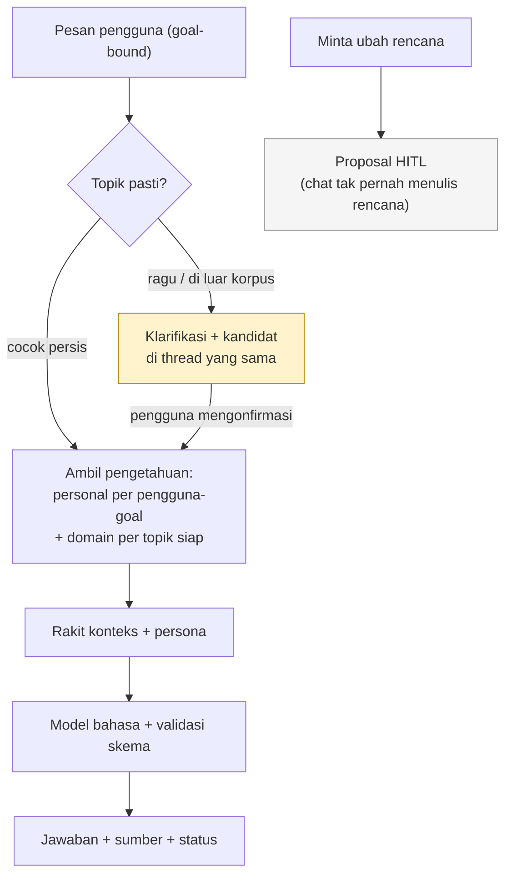

# ADR v3-003: Chat Coach Berbasis Pengetahuan per Goal

## Status

**Proposed — 3 Oktober 2026.** Keputusan di bawah dirumuskan dari uji coba (PoC) di `team/.idea/post-demo/llm-poc/code-v2/` yang diringkas dalam satu paket bukti (`docs/19-basis-adr-v3-003.md`). ADR ini memutuskan arsitektur untuk kode `team/`, bukan mencatat interior PoC: detail harness, path berkas PoC, dan perintah reproduksi tetap tinggal di dokumen PoC.

Karena bukti PoC masih terbatas (korpus sintetis yang sempit, satu kali pengukuran gerbang, penilai berupa model bukan manusia), sebagian keputusan bersifat **bersyarat**: berlaku dengan gerbang penerimaan yang tercantum di tiap keputusan. Status fase PoC tidak diubah ADR ini: pengujian memori personal lulus, pengujian retrieval semantik ditahan, pengujian percakapan selesai, dan riset agen domain masih sebatas seam status.

## Konteks

### Latar belakang dan masalah

Chat coach saat ini merakit konteks dari profil, tugas, dan hanya beberapa pesan terakhir. Akibatnya fakta yang disampaikan pengguna di luar jendela itu — batasan jadwal, preferensi, tenggat eksternal, gaya belajar — hilang dari jawaban. Kebutuhan arsitekturnya: memberi coach **ingatan lintas sesi** dan **pengetahuan domain yang bersumber**, dengan tiga syarat yang tidak boleh dilanggar (diwarisi ADR v3-001/v3-002 dan ADR-007): tidak ada kebocoran fakta antar pengguna atau antar goal, tidak ada tebakan saat topik belum pasti, dan chat tidak pernah mengubah rencana tanpa persetujuan pengguna (HITL).

### Bukti yang tersedia — dan batasnya

PoC menguji tiga perlakuan dalam kondisi identik (sistem prompt, model, dan suhu sama; hanya isi konteks yang dibedakan) dan dinilai dengan rubrik relevansi 0–3 oleh model penilai independen:

| Istilah PoC | Arti dalam bahasa arsitektur | Hasil ringkas |
| --- | --- | --- |
| Konteks dasar | Profil + tugas + riwayat thread, tanpa memori tambahan | Skor 0,917 — fakta lintas sesi praktis tidak terjawab |
| + Fakta personal (distilasi riwayat menjadi kartu fakta atomik per pengguna-per-goal) | Ingatan lintas sesi tanpa pencarian semantik | Skor 2,875 (selisih +1,958; ulangan +1,792) — lulus gerbang |
| + Retrieval semantik (embedding + vector store, ambil top-k relevan) | Ingatan lintas sesi dengan pencarian semantik | Selisih 0,000 terhadap fakta personal — gerbang tidak lolos, ditahan |

Bukti pendukung lain: isolasi partisi dan pengikatan thread–goal lulus uji termasuk probe adversarial (mencoba membaca thread pengguna lain dan goal asing, keduanya ditolak); penentuan topik domain tanpa tebakan mencapai nol salah-arah pada tiga perangkat uji independen; klarifikasi tuntas dalam satu thread yang sama; sitasi mekanik terverifikasi pada 36 dari 37 klaim dengan 4 dari 4 kasus adversarial tertolak; tiga topik sensitif hanya lolos lewat tinjauan manusia bernama (dua diterima, satu dinyatakan bukti-belum-cukup); akses jaringan terbatas pada 11 host yang disetujui dengan pagu $0,50 per run (terpakai $0,006665); status pengetahuan bertahan across restart pada pengandar ganda memori/Postgres yang diuji live.

Batas bukti yang harus dibaca bersama setiap keputusan: (1) topik uji masih artifisial dan sempit (contoh: mekanika gitar/drum/bass), belum topik edukasi nyata; (2) tiap gerbang baru diukur satu kali — angka presisi sempurna pada kecocokan-persis berdiri di atas satu sampel, bukan distribusi; (3) penilai adalah model, bukan manusia atau panel; (4) antarmuka streaming/state baru dijamin kontrak dan uji statis, belum uji browser nyata. Karena itu keputusan bernomor 2, 3, dan 4 di bawah membuka kembali saat bukti nyata tersedia, dengan gerbang yang eksplisit.

### Batasan yang ditetapkan pemilik (diterima sebagai input, bukan diputuskan di sini)

Lanjut versi sederhana; fitur berat ditahan (akses di luar daftar izin, aktivasi otomatis, dan jawab-otomatis di luar kecocokan persis). Prinsip "bertanya bila ragu" tetap berlaku untuk versi pertama, dengan persiapan 10–15 contoh berlabel per topik dan sasaran presisi ≥0,95 sebelum jawab-otomatis apa pun dibuka. Daftar izin berisi 11 host. Tinjauan manusia tahap pertama dikerjakan bernama oleh muhamad.

## Keputusan

### 1. Ingatan lintas sesi dibangun dari fakta personal yang didistilasi, diisolasi per pengguna-per-goal

Coach menyimpan ringkasan fakta atomik (satu fakta per kartu: batasan, preferensi, tenggat, atau gaya, beserta sumber asalnya dan tingkat keyakinannya) yang diekstrak dari riwayat per pasangan pengguna–goal. Setiap fakta terikat pada partisi miliknya; retrieval tidak pernah melintasi partisi. Percakapan berjalan di atas thread eksplisit yang terikat pada tepat satu goal secara immutable; thread tanpa goal hanya memakai konteks dasar tanpa menyentuh partisi mana pun, dan tidak ada fallback diam-diam ke goal lain.

*Dasar bukti: isolasi partisi + binding thread/goal (paket bukti §1 baris 1); fakta personal menaikkan relevansi +1,958 pada gerbang mode nyata (baris 2). Berlaku penuh; bukan bersyarat.*

### 2. Pencarian semantik (embedding/vector store) ditahan sampai terbukti menambah nilai

Infrastruktur embedding dan vector store disiapkan sebagai antarmuka yang dapat dipasang-cabut, tetapi tidak diaktifkan di produksi. Alasannya: pada bukti yang ada ia tidak mengungguli injeksi fakta personal langsung (selisih 0,000, jauh di bawah syarat +0,5), sementara ia menambah biaya, latensi, dan permukaan privasi. Pintu dibuka kembali bila salah satu terpenuhi pada pengukuran nyata: korpus per-goal yang jauh lebih besar menunjukkan pencarian top-k memilih lebih baik, atau hipotesis dirumuskan ulang sebagai efisiensi (kualitas setara dengan token/latensi lebih rendah).

*Dasar bukti: gerbang mode nyata baris 3 (3 dari 4 kriteria lolos; yang gagal hanya margin relevansi). Keputusan bersyarat dengan gerbang di atas.*

### 3. Topik ditentukan eksplisit tanpa tebakan; yang meragukan diklarifikasi dalam thread yang sama; tanpa kepastian tidak ada pengambilan pengetahuan

Hanya pertanyaan yang cocok persis dengan satu topik yang dijawab langsung. Sisanya — kecocokan leksikal, ambiguitas, atau di luar korpus — dijawab dengan klarifikasi yang menyajikan kandidat, dan jawaban klarifikasi pengguna menuntaskan resolusi di thread dan goal yang sama (pertanyaan asli diputar ulang, bukan dibuang). Selama topik belum terkonfirmasi, sistem tidak melakukan pencarian, tidak mengambil cache, dan tidak mengambil pengetahuan domain. Jawaban dikirim bertahap (streaming) dengan status percakapan yang eksplisit dan terpisah dari status pengetahuan domain.

*Dasar bukti: nol salah-arah pada tiga harness independen + klarifikasi 3-turn satu-thread stabil (baris 4–5); kontrak streaming dan UI 4-state stabil (baris 6). Berlaku penuh; pelonggaran pencocokan adalah pekerjaan lanjutan bergerbang (lihat Konsekuensi).*

### 4. Setiap klaim berpengetahuan wajib tertelusur ke sumber yang benar-benar diambil; topik sensitif wajib lewat manusia

Setiap fakta domain menyimpan identitas sumbernya, judul dan waktu ambil, serta penunjuk ke potongan sumber yang mendukungnya; pemeriksa terpisah memastikan potongan itu benar-benar mendukung klaim sebelum fakta disimpan — alamat URL saja tidak cukup. Topik berisiko (agama, kesehatan, keuangan, dan sejenisnya) tidak pernah berstatus siap-tayang tanpa penerimaan eksplisit peninjau manusia bernama; penolakan berarti korpus dinyatakan bukti-belum-cukup (keterbatasan sumber, bukan vonis atas isi), dan pengisian ulang lewat jalur riset yang sama.

*Dasar bukti: sitasi mekanik 36/37 + adversarial 4/4 (baris 7); tiga topik medium ditinjau bernama, nol siap-otomatis (baris 8). Berlaku penuh.*

### 5. Akses jaringan hanya ke daftar sumber yang disetujui, gagal-tertutup, dengan pagu biaya yang ditegakkan

Satu-satunya komponen yang boleh keluar ke jaringan adalah pengambil sumber, dan hanya ke host dalam daftar izin (default menolak). Batas transport (protokol, redirect, ukuran konten) ditegakkan; kegagalan dalam bentuk apa pun menutup akses, bukan membukanya. Setiap run riset tunduk pada pagu $0,50 yang diperiksa sebelum pemanggilan provider; model cadangan hanya untuk kegagalan laju/batas/transien dan setiap pemakaiannya tercatat. Isi halaman web diperlakukan sebagai data tak-tepercaya, bukan instruksi.

*Dasar bukti: 11 host, belanja $0,006665 dari pagu $0,50, fallback tak pernah terpakai namun tercatat (baris 9). Berlaku penuh; penambahan host adalah keputusan pemilik.*

### 6. Status pengetahuan persisten, berversi, dan dapat diaudit; pemetaan baru tidak mengubah perilaku diam-diam

Status resolusi topik, status korpus, antrean tinjauan, dan versi indeks bertahan across restart (pengandar memori untuk pengembangan, Postgres untuk layanan; baca selalu dari memori, tulis ke database diantrekan dengan kegagalan yang aman-tidak-mengubah-hasil). Pemetaan goal ke topik hanya lahir dari penulisan eksplisit (kurasi atau persetujuan pengguna) — tidak pernah diturunkan otomatis — sehingga penambahan pemetaan tidak mengubah perilaku goal lama dan tidak mengikat ulang thread berjalan secara diam-diam. Setiap anggota pemetaan hanya dibaca bila korpusnya berstatus siap; anggota yang belum siap dilewati dengan status degradasi yang terlihat, bukan klaim tanpa dukungan.

*Dasar bukti: roundtrip Postgres hijau + hydrate dan validasi ulang (baris 10); pemetaan eksplisit tanpa perubahan perilaku, diverifikasi byte-identik (baris 11). Berlaku penuh untuk lingering; Postgres produksi menunggu keputusan tersendiri.*

## Konsekuensi

### Positif

- Fakta lintas sesi terjawab oleh komponen berisiko rendah (fakta personal + isolasi partisi) tanpa mengunci keputusan infrastruktur retrieval.
- Jalur domain tertutup terhadap tebakan: tanpa kepastian tidak ada retrieval, sehingga halusinasi topik tertekan di sumbernya.
- Kepercayaan terbangun struktural: sitasi tertelusur + gerbang manusia untuk sensitif + jaringan berdaftar-izin.
- Semua yang berat (retrieval semantik, multi-topik, pengayaan otomatis) tetap di belakang gerbang terukur, bukan dihapus — dapat dibuka dengan bukti, bukan dengan keyakinan.

### Negatif dan trade-off

- Fakta personal disuntik seluruhnya per turn: token tumbuh bersama korpus sampai retrieval semantik dibuka sebagai jawaban efisiensi.
- Penentu topik yang ketat menolak pertanyaan wajar yang berfrasa bebas; pengalaman percakapan terasa bertanya terus sampai pencocokan dilonggarkan dan presisinya dibuktikan ulang.
- Pengikatan goal yang immutable berarti pindah goal wajib thread baru; tidak ada migrasi sesi lama.
- Fakta hasil distilasi dapat basi bila riwayat bertambah; produksi butuh pemicu distilasi ulang.
- Pemindai privasi bawaan hanya regex; sebelum data nyata perlu klasifikasi lebih kuat.

### Alternatif yang ditolak

| Alternatif | Alasan ditolak / gerbang pembuka |
| --- | --- |
| Buka retrieval semantik sekarang | Belum ada bukti ia mengalahkan fakta personal; dibuka bila gerbang Keputusan §2 terpenuhi |
| Jawab-otomatis di luar kecocokan persis | Skor top-1 kandidat tak-persis 0,354, jauh di bawah sasaran 0,95; dibuka bila presisi ≥0,95 pada 10–15 contoh/topik |
| Retrieval lintas-topik, hierarki, loop pengayaan katalog | Masih rancangan tanpa implementasi; dibuka berurutan setelah pemetaan eksplisit + bukti ulang presisi |
| Campuran konteks personal–domain sekaligus | Aturan kombinasinya belum diputuskan; dibuka bila disepakati (fakta personal tak boleh menentukan topik) |
| Ambang keyakinan sebagai kebijakan tetap | Baru satu pengukuran; presisi sempurna berdiri di atas satu sampel |
| Postgres produksi, aktivasi otomatis, bukti browser-nyata | Masing-masing menunggu pengujiannya sendiri (beban produksi, keputusan fase, uji browser) |

## Keputusan terkait

| Dokumen | Hubungan |
| --- | --- |
| [ADR v3-001: Arsitektur Adaptive Check-In](./v3-001-adaptive-check-in-architecture.md) | Guardrail static-first/rule-first/HITL dan evidence yang tidak boleh dilanggar chat berpengetahuan. |
| [ADR v3-002: Penyimpanan dan Siklus Hidup Proposal Adaptif](./v3-002-adaptive-proposal-storage-lifecycle.md) | Pola persistence, audit, dan ownership yang diikuti komponen pengetahuan. |
| Paket bukti `team/.idea/post-demo/llm-poc/code-v2/docs/19-basis-adr-v3-003.md` | Satu-satunya sumber angka ADR ini; tetap non-governed, tidak naik tingkat oleh ADR ini. |
| [ADR-007: AI Coach with Human-in-the-Loop](../007-ai-coach-hitl.md) | Chat berpengetahuan tidak boleh melewati HITL untuk perubahan rencana. |
