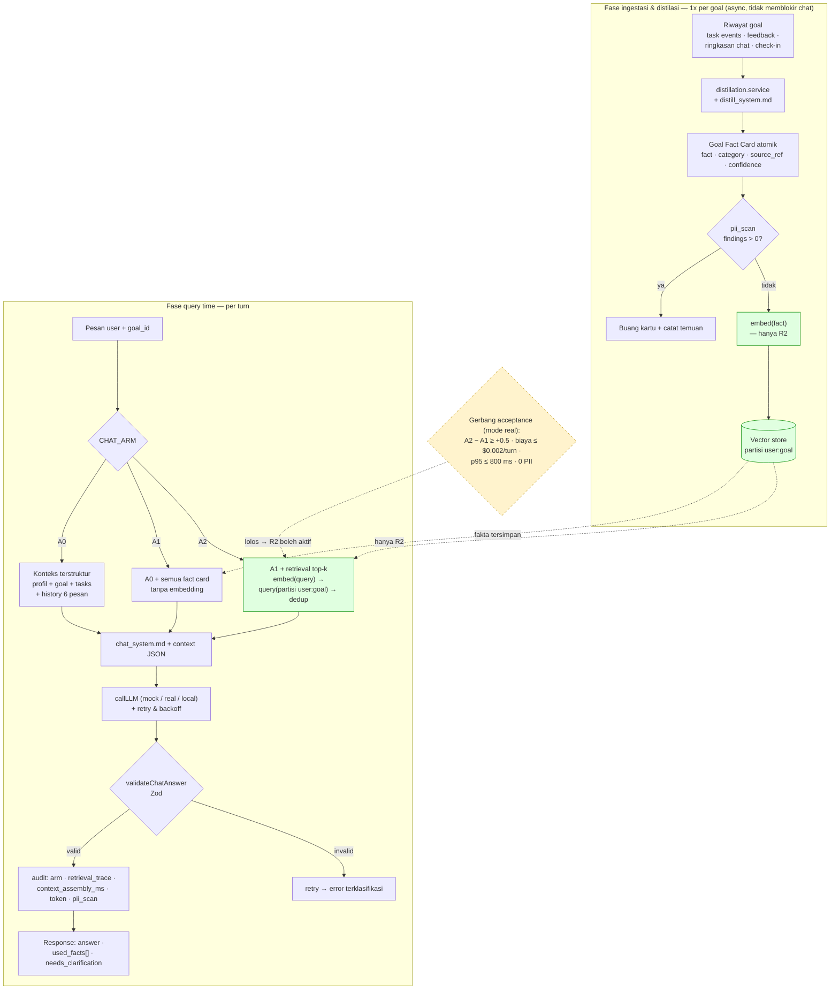
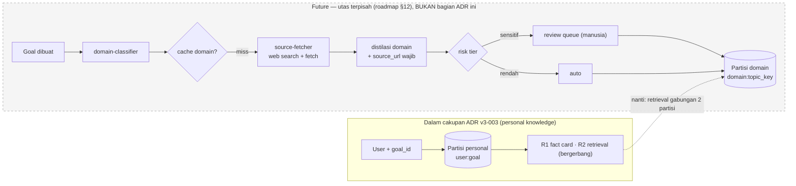

# ADR v3-003: Coach Chatbot Grounded-Goal — Thread/Goal Binding, Chat Tanpa Mutasi Rencana, Knowledge (R1 diadopsi, R2 bergerbang)

## Status

**Proposed — belum diterima.** Konsep arsitektur sudah stabil dan siap dipromosikan dari PoC, tetapi status acceptance **ditahan** sampai gerbang validasi mode `real` terpenuhi (lihat §"Gerbang acceptance").

**Revisi 28 Sep 2026 (konten diselaraskan dengan penerapan):** keputusan *chat context integrity* (thread scoping + goal binding immutable; chat tidak pernah memutasi rencana) yang semula dinyatakan sebagai utas terpisah kini **menjadi bagian ADR ini** (Keputusan §8–§11), karena grounded-goal chat tidak bisa ditegakkan tanpanya. Status tetap **Proposed**; acceptance tetap ditahan sampai gerbang mode `real`.

- Tanggal draft: 28 September 2026
- Asal: PoC RAG goal-distillation — [`03-results.md`](../../../.idea/post-demo/llm-poc/03-results.md), [`04-decision-memo.md`](../../../.idea/post-demo/llm-poc/04-decision-memo.md)
- SRS pendamping: [`srs-input-rag-goal-knowledge-chat.md`](../../../.idea/post-demo/srs-draft/srs-input-rag-goal-knowledge-chat.md)
- Bukti kode: `team/.idea/post-demo/llm-poc/code/`
- Sifat dokumen: **keputusan baru** (bukan amandemen). Melengkapi v3-001/v3-002 tanpa mengubah guardrail-nya.
- Cakupan: kontekstualisasi chat berbasis knowledge per-goal (fact card terdistilasi), plus penempatan semantic retrieval sebagai rung terpisah.

## Konteks

Pipeline chat saat ini (`team/server/src/services/coach/dispatch.service.js`, `context-builder.service.js`) mengirim konteks terstruktur — profil, task, metrics, dan **6 pesan terakhir** — lalu memanggil LLM. Tidak ada embedding, vector store, maupun retrieval (terverifikasi nihil di codebase: tidak ada `embedding`/`vector`/`chunk`). Akibatnya, fakta yang dikatakan user **di luar window 6 pesan** (batasan jadwal, preferensi slot, deadline eksternal, preferensi gaya) hilang dari jawaban chat.

PoC 3-arm (A0 konteks terstruktur · A1 + fact card terdistilasi · A2 + retrieval semantik) dijalankan pada 48 pertanyaan × 3 arm dalam **mode mock** (offline, deterministik). Hasil proksi: target fact-hit A0 `0.000` → A1 `0.958` → A2 `0.917`; tidak ada regresi kontrol; **0 PII**; 8/8 unit test lulus. Ambang S4 direvisi 0.15 → 0.80 (pagar absolut $0.002 tetap) sehingga verdict mock = `go` **provisional**.

Dua kenyataan menentukan bentuk keputusan ini: (a) A1 **tidak kalah** dari A2 pada fact-hit (0.958 vs 0.917) sementara A2 memakai token **lebih sedikit** (381.6 vs 414.6); (b) **mode `real` tidak dijalankan** — rubrik relevansi 0–3 (inti H1), anti-halusinasi sungguhan, dan biaya absolut belum terukur (tanpa `GEMINI_API_KEY`, SDK embedding belum terpasang). Karena itu retrieval semantik belum punya bukti nilai tambah di atas distilasi.

## Keputusan

### 1. Adopsi R1 sebagai rung pertama: fact card atomik hasil distilasi

Goal-knowledge chat dimulai dari **distilasi riwayat → Goal Fact Card atomik** (tanpa embedding). Fact card ditambahkan ke konteks sebagai `facts[]`, memakai **prompt sistem, model, dan temperature yang sama** dengan A0 — hanya isi `context` yang berbeda, agar efek dapat diatribusikan.

Alasan A1 lebih dulu: lompatan proksi terbesar (A0 0 → A1 0.958), footprint paling kecil (tanpa vector store, tanpa biaya embedding), privasi paling sederhana, dan reversibel via flag.

### 2. Semantic retrieval (R2) ditahan di belakang gerbang keputusan

R2 (embedder + vector store + retrieval top-k) **tidak** dibuka otomatis. Implementasi interface disiapkan (pluggable) tetapi pengaktifan di produksi menunggu gerbang §"Gerbang acceptance". Pada proksi, R2 belum mengalahkan R1, sehingga membuka R2 sekarang berarti menambah infrastruktur dan permukaan privasi tanpa bukti manfaat.

### 3. Ketiga arm hidup di belakang satu flag

`CHAT_ARM=A0|A1|A2` (pola sama dengan `AI_MODE=mock|real`) memilih arm per deployment; override per request hanya untuk demo/eval. Ini menjaga harness eval dapat memanggil ketiga arm dalam satu proses dan memungkinkan rollback ke A0 tanpa migrasi data.

### 4. Partisi `user:goal` wajib untuk vector store

Setiap vektor disimpan dengan `partition_key = ${userId}:${goalId}`. Retrieval tanpa partisi berisiko membocorkan fakta antar goal (atau antar user). Isolasi ini diuji sebagai acceptance criterion, bukan opsional. Migrasi ke pgvector nanti mengganti isi interface, bukan kontraknya.

### 5. Fact card atomik + schema-first (bukan chunking dokumen)

Distilasi menghasilkan **satu fakta atomik per kartu** dengan `category ∈ {constraint, preference, deadline, style}`, `source_ref` (untuk audit, bukan isi mentah), dan `confidence ∈ {stated, inferred}`, divalidasi Zod (`fact.schema.js`). Ini memetakan langsung ke 4 jenis fakta tanam eksperimen dan memungkinkan penilaian per kategori, bukan hanya agregat.

### 6. Jawaban chat wajib transparan dan anti-halusinasi

`ChatAnswerSchema` mewajibkan `used_facts[]` (fakta yang benar-benar dipakai) dan `needs_clarification` (menolak/klarifikasi saat di luar konteks). `used_facts` adalah instrumen transparansi user sekaligus dasar penilaian otomatis "fakta kunci ada".

### 7. Privasi: pii_scan sebelum embed/simpan

Sebelum teks masuk `embed()` atau disimpan sebagai fact card, `pii_scan` (regex email/telepon/NIK-like) dijalankan; kartu ber-PII dibuang. Konteks ke LLM tidak pernah memuat `user_id`/email/nama (mewarisi `sanitizeContext`). Target: **0** temuan PII pada konten ter-embed.

### 8. Thread sebagai entitas; binding goal immutable (goal 1 ─ N thread)

Chat grounded-goal berjalan di atas **thread** eksplisit: `{ id, user_id, goal_id, status, created_at, closed_at }`. `thread_id` adalah id opaque yang di-generate server (immutable, unik) dan selalu di-lookup owner-scoped `(user_id, thread_id)`. Riwayat pesan **thread-scoped** — menggantikan perilaku lama `findRecentByUser` yang membocorkan riwayat antar sesi.

`goal_id` adalah **properti thread yang immutable** dan nullable. Satu goal boleh memiliki banyak thread (goal 1 ─ N thread); satu thread memiliki tepat satu `goal_id`. `goal_id = null` berarti **mode umum**: hanya R0 dengan profil + riwayat thread, **nol partisi pengetahuan**. Tidak ada fallback diam-diam ke goal terbaru akun. `goal_id` per turn hanya dipakai untuk membuat thread atau meng-assert konsistensi (mismatch → error), bukan untuk me-rebind thread.

### 9. Jalur chat tidak pernah memutasi rencana (kontrak tanpa `plan`)

`ChatAnswer` **tidak punya field `plan`**. Handler chat tidak memiliki jalur persist rencana. Niat mengubah rencana dipetakan (deterministik) ke **proposal HITL** lewat `plan-bridge`, yang tidak pernah auto-persist dan menolak `goal_id` null (tidak membuat goal diam-diam). Jaring pengaman `plan_leak`: bila keluaran mentah model masih membawa `plan != null`, field di-strip dan kejadiannya dicatat di audit sebagai `plan_leak` (bukan kegagalan turn).

### 10. Scope metrik: goal-level, rollup user-global terpisah

Metrik dasar dicatat per **goal** (`scope = goal|general`, `path = R0|plan`), dengan `goal_id` pada catatan audit. Agregat **user-global** disediakan sebagai rollup terpisah dan berlabel; tidak pernah dicampur ke metrik goal. Query task/progress yang benar-benar goal-scoped adalah prasyarat agar angka "goal-level" tidak sekadar alias dari metrik user-global.

### 11. Drift / goal-less: eksplisit, tanpa rebind

Thread goal-less adalah kontainer kelas satu (R0-only). Drift topik **tidak** me-rebind thread berjalan: eskalasinya adalah (i) thread baru pada goal yang sama, lalu (b) usulan goal/topic baru lewat HITL. `plan-bridge` menolak `goal_id` null sehingga jalur HITL pun tidak bisa menciptakan goal secara diam-diam.

### Gerbang acceptance

ADR ini menjadi **Accepted** hanya bila run mode `real` memenuhi **semua**:

1. Rubrik relevansi target: **A2 − A1 ≥ +0.5** (bukan hanya A2 > A0) — membuktikan retrieval mengalahkan distilasi saja; **dan**
2. Biaya absolut A2 **≤ $0.002/turn**; **dan**
3. A2 context-assembly p95 **≤ 800 ms**; **dan**
4. **0** PII pada konten ter-embed.

Bila A2 ≤ A1 pada rubrik real, R2 tetap tertutup dan hanya R1 yang berjalan (keputusan tetap valid dengan mengubah cakupan R2 menjadi "rejected/deferred"). Bila rubrik real tidak memisahkan A0 vs A1, kill criteria K1/K3 terpenuhi dan keputusan ini di-**supersede**.

## Alur Data Rancangan

Dua fase dipisahkan tegas: **ingestasi/distilasi** (jarang, 1× per goal, tidak memblokir chat) dan **query time** (per turn). Kotak bergaris putus-putus = masih di belakang gerbang.

**Cara membaca:** R1 = jalur `A1` (pakai `facts[]` langsung dari fase ingestasi). R2 = jalur `A2` + `embed`/`Vector store`, hanya aktif bila gerbang lolos. Jalur `A0` tidak menyentuh knowledge sama sekali. Semua arm berbagi `PROMPT`, `LLM`, `VALID`, dan `AUDIT` yang identik agar efek terisolasi.

## Batas Cakupan & Utas Terkait (yang sengaja TIDAK ada di diagram)

Diagram di atas hanya memuat **knowledge personal** (partisi `user:goal`). **Web search / research agent untuk korpus domain** — §12 [`artifacts/roadmap.md`](../../../.idea/post-demo/llm-poc/artifacts/roadmap.md) — berada **di luar cakupan ADR ini** dan belum diimplementasikan di PoC (`code/` tidak punya `research-agent/`). Alasannya:

- **Domain berbeda.** Fact card di sini berisi fakta *tentang user*; research agent mengambil pengetahuan *tentang topik/dunia*. Menyatukannya membuat dua variabel independen (efek retrieval personal vs efek grounding domain) tercampur dalam satu verdict.
- **Profil risiko berbeda.** Research agent butuh **egress jaringan** (`source-fetcher`), sitasi wajib, dan **review queue manusia** untuk domain sensitif (agama/kesehatan/keuangan) — kebutuhan infra & governance yang tidak ada di PoC 3 hari.
- **Golden set berbeda.** Penilaian faktual/sitasi ≠ rubrik relevansi 0–3; butuh harness penilaian sendiri.
- **Utang yang sudah dicatat.** Roadmap §12 sudah mendesainnya (partisi terpisah `domain:{topic_key}`, `DomainFactCardSchema`, `trust_tier`), termasuk catatan "jangan digabung ke timebox PoC ini".

**chat context integrity** (session scoping + goal binding) kini **termasuk** cakupan ADR ini (Keputusan §8–§11) sebagai prasyarat grounded-goal chat; reference kondisi aktualnya tetap di `reference/chat-pipeline-graph.md`. Utas lain yang tetap **di luar** ADR ini (jangan dicampur): **provider management** (draf ADR terpisah, jadi `v3-004`) dan **transport streaming** (decision memo terpisah).

## Alasan

1. **Urutan bukti, bukan urutan gengsi.** Distilasi (R1) memindahkan fakta yang tak terjangkau window 6 pesan; retrieval (R2) hanya efisiensi/semantik tambahan. Proksi mendukung R1 kuat, R2 belum.
2. **Biaya/kegagalan minimal lebih dulu.** R1 tidak menambah infra (vector DB, biaya embedding) maupun permukaan privasi baru; risiko adopsi terkecil pada iterasi pertama.
3. **Isolasi data adalah syarat keamanan, bukan optimasi.** Partisi `user:goal` mencegah kebocoran lintas goal/user.
4. **Transparansi + schema-first menjaga trust dan testability**, mewarisi pola `ai-integration-demo` (prompt terpisah, Zod, mock/real, audit).
5. **Reversibilitas.** Semua arm di balik flag; embedding/vector store adalah interface pluggable — mematikan R1/R2 kembali ke A0 tanpa migrasi.

## Konsekuensi

### Positif

- Kebutuhan "ingat fakta lintas sesi" terjawab oleh komponen berisiko rendah (fact card) tanpa mengunci keputusan infra retrieval.
- Isolasi percakapan menjadi struktural: riwayat thread-scoped + binding `goal_id` immutable membuat retrieval tidak mungkin melintasi partisi selama satu thread hidup.
- Jalur chat tidak lagi bisa memutasi rencana: kontrak `ChatAnswer` tanpa `plan` + `plan-bridge` HITL menutup kebocoran auto-persist.
- Keputusan R2 memiliki gerbang terukur (A2 vs A1, biaya absolut), bukan bergantung pada proksi.
- Isolasi `user:goal` dan transparansi `used_facts` menjadi bagian kontrak sejak awal.
- Migrasi pgvector tidak mengubah route/frontend (kontrak interface tetap).

### Negatif dan trade-off

- R1 meng-inject **semua** fact card per turn (token lebih tinggi dari top-k); perlu batas jumlah kartu/korpus agar tidak membengkak.
- Klaim "metrik goal-level" baru sah setelah query task/progress di-scope per goal; sebelum itu angka tersebut harus diperlakukan sebagai user-global.
- Binding immutable berarti perpindahan goal mengharuskan thread baru; tidak ada migrasi identitas sesi chat legacy (tidak ada data untuk dimigrasikan).
- Distilasi berjalan 1× per goal; fact card bisa **stale** bila riwayat terus bertambah — produksi butuh trigger re-distilasi (mis. tiap N event).
- `pii_scan` berbasis regex cukup untuk data sintetis; sebelum data nyata, perlu classifier lebih kuat.
- Verdict dari data mock **provisional**; ADR tidak boleh di-Accept sebelum run real.
- Penomoran ADR perlu koordinasi dengan draf provider management yang juga mengincar `v3-003`.

## Alternatif yang ditolak

| Alternatif | Alasan ditolak |
| --- | --- |
| **Do nothing** (tetap A0) | Tidak menjawab kebutuhan memori lintas sesi; proksi menunjukkan A0 target fact-hit `0.000`. |
| **Buka R2 sekarang** | Belum ada bukti (hanya proksi) A2 > A1; menambah infra, biaya embedding, dan permukaan privasi tanpa manfaat terbukti. |
| **Embed raw turns, bukan fact card terdistilasi** | Biaya embedding & privasi lebih besar, dedup dan kategori lebih sulit diaudit; ditahan sampai ada kebutuhan yang terbukti. |
| **Satu index vektor tanpa partisi** | Risiko kebocoran lintas goal/user; isolasi `user:goal` adalah syarat, bukan opsi. |
| **pgvector sejak hari-1** | Terlalu dini sebelum R2 terbukti; in-memory + interface pluggable sudah memadai untuk menilai arah, dengan catatan latensi produksi berbeda. |
| **Binding goal per-turn / active-goal akun** | Membuat transcript tidak koheren dan berisiko bocor antar goal; melanggar aturan "tanpa fallback diam-diam". |
| **Membiarkan chat menulis rencana saat model mengembalikan `plan`** | Melanggar HITL; inilah kebocoran auto-persist yang ditutup Keputusan §9. |
| **Auto-rebind thread ke goal terdekat saat drift** | Fallback diam-diam; merusak isolasi partisi `user:goal`. |

## More Information

- PoC results (mock) + status mode real: [`03-results.md`](../../../.idea/post-demo/llm-poc/03-results.md)
- Decision memo (opsi, evidence, decision rule, reversibility): [`04-decision-memo.md`](../../../.idea/post-demo/llm-poc/04-decision-memo.md)
- Experiment plan + ambang §6: [`02-experiment-plan.md`](../../../.idea/post-demo/llm-poc/02-experiment-plan.md)
- SRS pendamping: [`srs-input-rag-goal-knowledge-chat.md`](../../../.idea/post-demo/srs-draft/srs-input-rag-goal-knowledge-chat.md)
- Kode PoC: `team/.idea/post-demo/llm-poc/code/` (arm A0/A1/A2, `knowledge/`, `eval/`, `tests/`)

## Confirmation

Kepatuhan diverifikasi melalui:

- **Unit test** `code/tests/poc.test.js` — 8/8 lulus, termasuk **isolasi partisi** `user:goal` dan isolasi antar-goal.
- **Harness P0 grounded-goal** `code-v2/tests/p0.test.js` — 10/10 lulus (mock deterministik, tanpa API key): isolasi thread & goal, skema valid/invalid, `plan=null` tanpa auto-persist saat mock mengembalikan `plan`, `pii_scan`, routing deterministik, dan pemisahan scope metrik. Probe adversarial: cross-user `THREAD_NOT_FOUND`, foreign goal `GOAL_NOT_FOUND`, plan-leak pada thread general → `plan=null` + `plan_leak`, output invalid → error + `plan=null`, `persistPlan` calls = 0.
- **Harness eval** `code/eval/run-eval.js` + `code/eval/evaluate-thresholds.js` — fungsi murni S1–S5/K1–K3; `npm run eval` mereproduksi agregat + verdict.
- **Uji anti-halusinasi & rubrik relevansi** dijalankan di mode `real` (belum; bagian dari gerbang acceptance).
- Setelah implementasi produksi: test kebocoran partisi + audit `pii_scan` pada CI.

## Keputusan terkait

| Dokumen | Hubungan |
| --- | --- |
| [ADR v3-001: Arsitektur Adaptive Check-In](./v3-001-adaptive-check-in-architecture.md) | Guardrail static-first/rule-first/HITL dan evidence yang tidak boleh dilanggar chat knowledge. |
| [ADR v3-002: Penyimpanan & Siklus Hidup Proposal Adaptif](./v3-002-adaptive-proposal-storage-lifecycle.md) | Pola persistence/audit dan ownership yang diikuti komponen knowledge. |
| [ADR-004: AI Multi-Provider](../004-ai-multi-provider.md) | Chain fallback & validasi output 4 lapis yang diwarisi `callLLM`. |
| [ADR-007: AI Coach HITL](../007-ai-coach-hitl.md) | Chat knowledge tidak boleh melewati HITL untuk perubahan rencana. |
| [ADR-008: Observability](../008-observability.md) | Audit trail sebagai sumber observability; `pii_scan` + `retrieval_trace` masuk metadata. |
| [ADR-009: Schema Validation & Input Security](../009-schema-validation-input-security.md) | Schema-first Zod yang diperluas untuk fact card & chat answer. |
| Draf provider management (`.idea/post-demo/adr-draft/adr-v3-001-llm-provider-management.md`) | **Koordinasi penomoran:** dokumen ini memakai `v3-003`; bila provider management ikut dipromosikan, beri `v3-004` dan catat pemetaannya di `00-index.md`. |

## Status History

| Tanggal | Status | Catatan |
| --- | --- | --- |
| 2026-09-28 | Proposed | Dipromosikan dari PoC mock; acceptance ditahan sampai gerbang run mode `real`. |
| 2026-09-28 | Proposed (revisi) | Konten diselaraskan dengan penerapan: chat context integrity (thread/goal binding, chat tanpa mutasi rencana, scope metrik) masuk Keputusan §8–§11; bukti harness deterministik `code-v2/tests/p0.test.js` (10/10). Acceptance tetap ditahan sampai gerbang mode `real`. |
