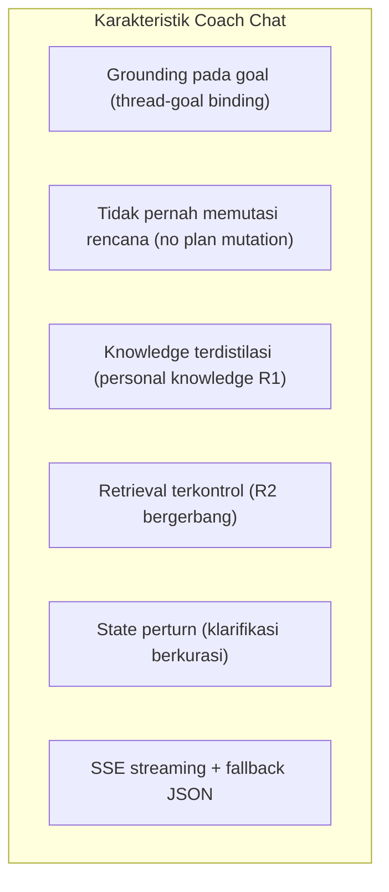
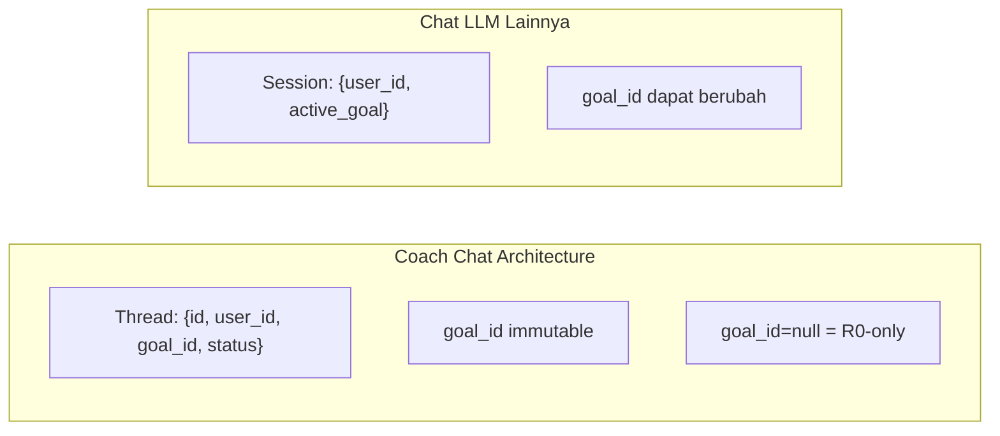
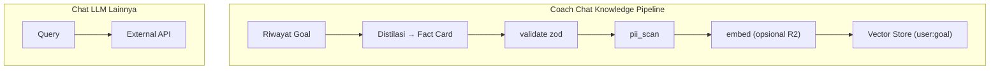
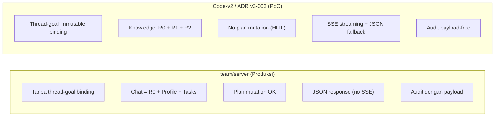
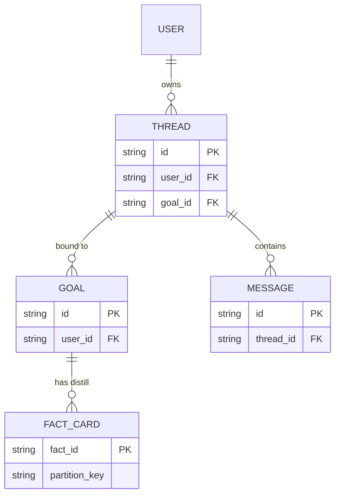

# ADR v3-003 (Revisi): Coach Chatbot Grounded-Goal — Thread/Goal Binding, Chat Tanpa Mutasi Rencana, Knowledge

**Status:** Draft revisi v_koma  
**Versi:** v_koma  
**Tanggal:** 3 Oktober 2026  

## 1. Pendahuluan: Apa Itu Coach Chat?

**Coach Chat** adalah jalur chatbot yang dirancang khusus untuk *goal-oriented conversation*:



## 2. Perbedaan Utama: Coach Chat vs LLM Chat Lainnya

### 2.1 Thread-Goal Binding (Immutable)

| Aspek | Coach Chat (code-v2) | Chat LLM Lainnya |
|-------|--------------------|-----------------|
| `goal_id` | Immutable pada thread | Bisa berubah/terdeteksi otomatis |
| `goal_id=null` | Mode umum (R0-only) | Biasanya otomatis bind ke goal terakhir |
| Fallback | Tidak ada auto-rebinding | Tidak ada isolasi goal |



### 2.2 Tanpa Mutasi Rencana (No Plan Mutation)

**Coach Chat:**
- `ChatAnswerSchema` TIDAK punya field `plan`
- Semua perubahan rencana lewat HITL proposal

**Chat LLM Lainnya:**
- Bisa langsung menyimpan/mengubah rencana pengguna

```mermaid
sequenceDiagram
    participant U as User
    participant C as Coach Chat
    participant P as Plan-Bridge
    U->>C: "Saya mau ganti jadwal"
    C->>P: toProposal()
    P->>Human reviewer
```

### 2.3 Knowledge Pipeline yang Terpisah



## 3. Perbandingan dengan Implementasi di team/server (Produksi)

✅ **PERINGAT:** Implementasi di `team/server` TIDAK sepenuhnya mengikuti desain di atas. Perbedaan utama:



### 3.1 Thread-Goal Binding

| Aspek | code-v2 (ADR) | team/server |
|-------|--------------|-------------|
| `goal_id` di Thread | Immutable, bind sejak thread dibuat | Tidak ada konsep thread |
| `thread_id` di request | Ada | Tidak ada |
| `goal_id=null` | Mode R0-only | Menggunakan goal aktif sebagai fallback |

### 3.2 Plan Mutation

Di `dispatch.service.js` (baris 225-234), chat response **bisa** berisi `plan` dan langsung di-persist:
```javascript
if (validated.plan) {
  await responseFormatter.persistPlan(userId, validated.plan, goalId);
}
```

Ini **melanggar** prinsip "No Plan Mutation" yang ditulis di ADR.

### 3.3 Knowledge Pipeline

| Fitur | code-v2 (ADR) | team/server |
|-------|--------------|-------------|
| Fact Card distillation (R1) | Ada | Tidak ada |
| Semantic retrieval (R2) | Ada | Tidak ada |
| PII scan | Ada | Tidak ada |
| `user:goal` partition | Ada | Tidak ada |

Chat di `team/server` hanya menggunakan R0 saja.

## 4. Diagram Entitas Utama Coach Chat



## 5. Gerbang Acceptace Mode Real

| Kriteria | Target |
|----------|--------|
| A2 - A1 (fact-hit) | ≥ +0.5 |
| Biaya A2 | ≤ $0.002/turn |
| Latency A2 p95 | ≤ 800ms |
| PII Findings | 0 |

## 6. Revisi Summary

Perbedaan utama yang ditulis di diagram:

1. **Thread-Goal Binding**: Coach chat mengikat goal secara immutable pada thread, sedangkan chat biasa tidak.
2. **No Plan Mutation**: Coach chat tidak pernah memutasi rencana, semua perubahan lewat HITL.
3. **Knowledge Pipeline**: Coach chat memakai distilasi goal ke fact card + retrieval terkontrol, berbeda dengan knowledge ad-hoc.
4. **SSE Streaming**: Kontrak streaming terpisah dengan fallback JSON, bukan pengaruh dari kontrak biasa.
5. **Audit Tanpa Payload**: Tidak menyimpan teks mentah di audit, melindungi privasi.

---

**Catatan:** Dokumen ini masih dalam status draft (v_koma) dan perlu review oleh tim sebelum dipromosikan ke versi resmi. Divergensi antara code-v2 (PoC) dan `team/server` (produksi) harus diselaraskan dengan tim arsitekturnya.
