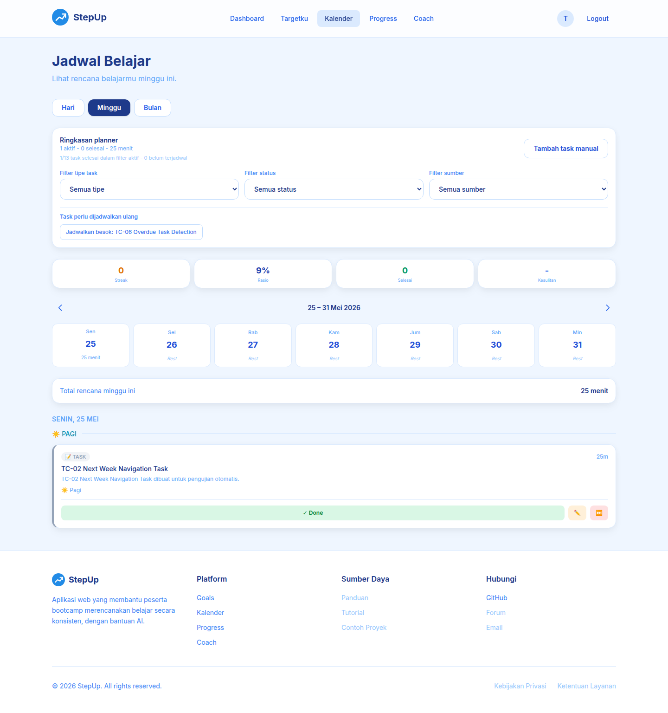
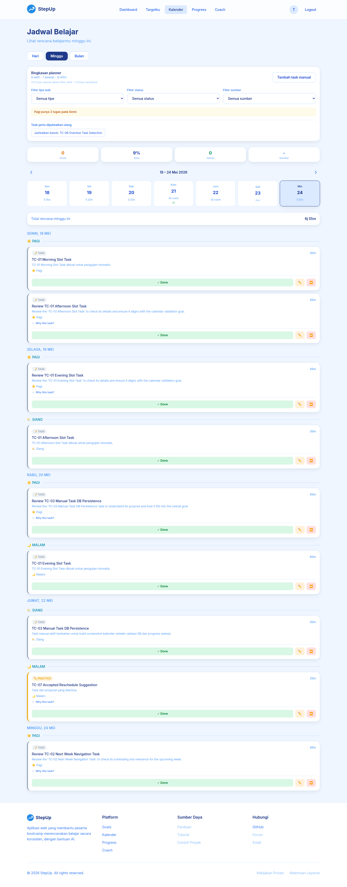
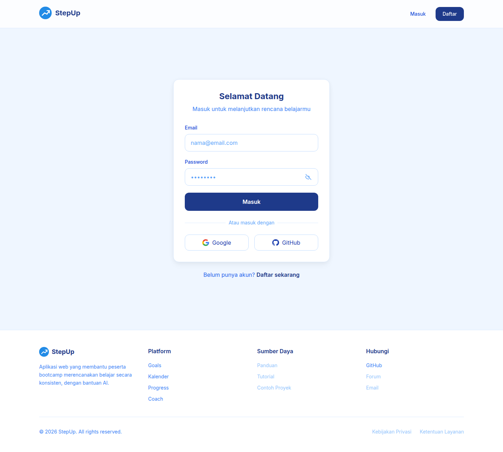
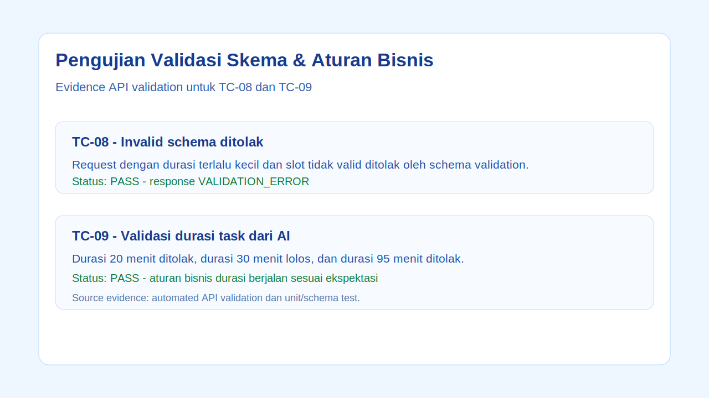
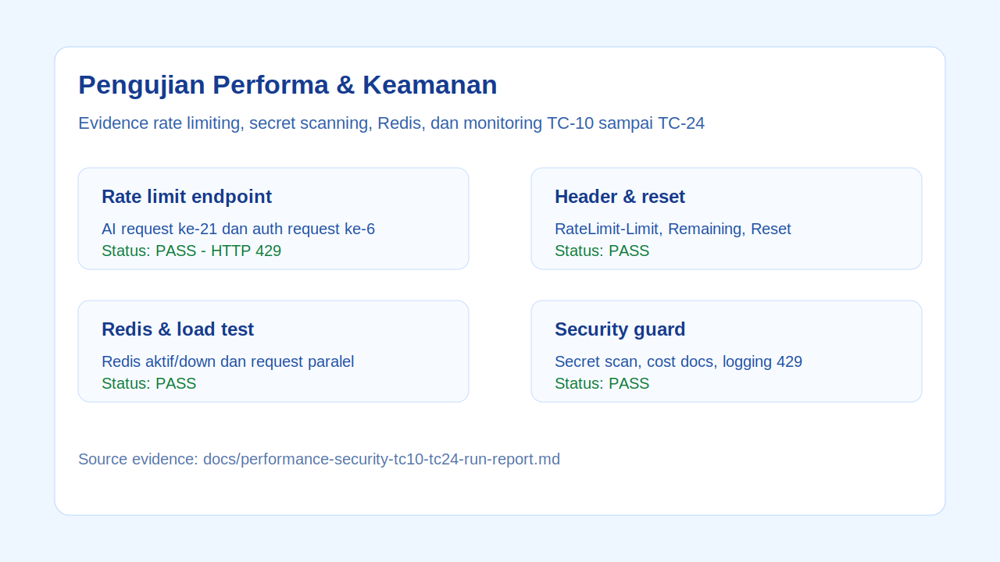

# README Submision 2

## 1. Pengujian Kalender & Navigasi

### TC-01: Memastikan tugas muncul di slot waktu kalender mingguan yang tepat sesuai timestamp.

Pengujian ini memastikan task yang memiliki `planned_date` dan `planned_slot` tampil di kalender mingguan pada posisi yang sesuai. Task pagi, siang, dan malam berhasil muncul di slot yang benar.

**Status:** PASS

### TC-02: Memastikan tombol navigasi minggu Next/Previous dapat berpindah pekan dan memuat data yang benar.

Pengujian ini memastikan tombol minggu berikutnya dapat menampilkan data task pada pekan selanjutnya, lalu tombol minggu sebelumnya dapat mengembalikan tampilan ke pekan awal dengan data yang sesuai.

**Status:** PASS

## 2. Pengujian Manajemen Tugas & Fitur AI

### TC-03: Membuat tugas baru secara manual dan memastikan data tersimpan di database.

Pengujian ini memastikan task manual bisa dibuat oleh user, tersimpan di database, dan dapat dibaca ulang melalui API dengan data yang sesuai.

**Status:** PASS

### TC-04: Membuat tugas berdasarkan rekomendasi/saran dari AI.

Pengujian ini memastikan rekomendasi dari AI bisa diterima dan dikonversi menjadi task belajar yang tersimpan di sistem.

**Status:** PASS

### TC-05: Mengubah status tugas dari todo ke done dan memvalidasi perubahan progress snapshot.

Pengujian ini memastikan saat task diubah menjadi `done`, progress belajar ikut diperbarui dan snapshot progress dapat terbaca dengan benar.

**Status:** PASS

### TC-06: Memastikan sistem mendeteksi tugas yang melewati tenggat waktu (overdue).

Pengujian ini memastikan task dengan tanggal rencana yang sudah lewat dapat dikenali sebagai overdue oleh sistem.

**Status:** PASS

### TC-07: Menguji fitur reschedule otomatis via AI untuk tugas overdue, lalu mencoba aksi Accept dan Reject pada saran tersebut.

Pengujian ini memastikan task overdue bisa mendapatkan saran reschedule, lalu flow Accept membuat perubahan sesuai saran dan flow Reject tidak menambahkan perubahan baru.

**Status:** PASS

## 3. Pengujian Validasi Skema & Aturan Bisnis

### TC-08: Mengirim data tidak valid ke endpoint baru untuk memastikan Schema Validation menolak permintaan tersebut.

Pengujian ini memastikan endpoint menolak request yang tidak sesuai schema, seperti durasi terlalu kecil atau slot yang tidak valid. Response yang diharapkan adalah error validasi, bukan data tersimpan.

**Status:** PASS

### TC-09: Menguji validasi durasi tugas dari AI.

Pengujian ini memastikan aturan durasi task dari AI berjalan sesuai kebutuhan bisnis: durasi 20 menit ditolak, durasi 30 menit diterima, dan durasi 95 menit ditolak.

**Status:** PASS

## 4. Pengujian Performa & Keamanan (Rate Limiting)

### TC-10: Melakukan request ke /api/ai/* sebanyak 21 kali dalam 1 menit untuk memicu status HTTP 429.

Pengujian ini memastikan endpoint AI membatasi request berlebihan. Request ke-21 dalam window 1 menit berhasil ditolak dengan HTTP 429.

**Status:** PASS

### TC-11: Melakukan request ke /api/auth/* sebanyak 6 kali dalam 1 menit untuk memicu status HTTP 429.

Pengujian ini memastikan endpoint auth seperti login/register memiliki proteksi dari request berulang. Request ke-6 dalam 1 menit berhasil ditolak dengan HTTP 429.

**Status:** PASS

### TC-12: Memastikan pesan response error HTTP 429 memberikan informasi yang jelas.

Pengujian ini memastikan response rate limit memberi pesan yang mudah dipahami, termasuk informasi bahwa user perlu mencoba lagi setelah beberapa detik.

**Status:** PASS

### TC-13: Memeriksa riwayat komit Git untuk memastikan tidak ada environment variable atau kunci API (secret) yang bocor.

Pengujian ini memastikan file aktif di repository tidak mengandung pola API key, token, private key, atau secret lain yang berbahaya.

**Status:** PASS

### TC-14: Dokumentasi biaya request AI per 100 request.

Pengujian ini memastikan estimasi biaya AI per 100 request sudah terdokumentasi agar tim bisa memperkirakan biaya operasional fitur AI.

**Status:** PASS

### TC-15: Memastikan rate limit akan reset setelah window waktu 1 menit selesai.

Pengujian ini memastikan user dapat melakukan request lagi setelah window rate limit selesai, sehingga user tidak terus terkena HTTP 429.

**Status:** PASS

### TC-16: Melakukan request ke /api/ai/* menggunakan dua user berbeda untuk memastikan rate limit dihitung per user.

Pengujian ini memastikan limit AI tidak bersifat global untuk semua user, tetapi dihitung berdasarkan user yang sedang login.

**Status:** PASS

### TC-17: Melakukan request ke /api/auth/* dari IP yang sama untuk memastikan rate limit auth dihitung berdasarkan IP address.

Pengujian ini memastikan pembatasan request auth berjalan berdasarkan IP address, sehingga percobaan login/register berulang dari sumber yang sama dapat dibatasi.

**Status:** PASS

### TC-18: Memeriksa response header rate limit seperti RateLimit-Limit, RateLimit-Remaining, dan RateLimit-Reset.

Pengujian ini memastikan response menyertakan header rate limit yang membantu client memahami batas request dan waktu reset.

**Status:** PASS

### TC-19: Melakukan pengujian rate limiting dengan Redis aktif untuk memastikan behavior development/production sama dengan unit test.

Pengujian ini memastikan Redis digunakan sebagai store rate limit pada environment non-test, sehingga behavior development dan production tetap konsisten.

**Status:** PASS

### TC-20: Melakukan pengujian saat Redis mati/down untuk memastikan sistem memiliki behavior yang jelas.

Pengujian ini memastikan saat Redis down, sistem memiliki behavior fail-closed yang jelas: error dicatat dan request tidak dibiarkan unlimited.

**Status:** PASS

### TC-21: Melakukan load test ringan dengan beberapa request bersamaan untuk memastikan backend tetap stabil saat traffic meningkat.

Pengujian ini memastikan backend tetap stabil saat menerima beberapa request paralel dan tidak langsung gagal saat traffic meningkat.

**Status:** PASS

### TC-22: Melakukan test bypass sederhana menggunakan header seperti X-Forwarded-For untuk memastikan rate limit tidak mudah dilewati.

Pengujian ini memastikan perubahan header sederhana tidak membuat user bisa melewati rate limit auth.

**Status:** PASS

### TC-23: Menambahkan secret scanning di CI pipeline untuk memastikan API key, token, dan environment secret tidak ikut ter-commit.

Pengujian ini memastikan pipeline CI memiliki step secret scan untuk mencegah secret masuk ke repository.

**Status:** PASS

### TC-24: Menambahkan monitoring/logging untuk request yang terkena HTTP 429 agar pola abuse atau trigger AI berlebihan bisa terdeteksi.

Pengujian ini memastikan request yang terkena HTTP 429 dicatat oleh logger dengan informasi penting seperti request id, route, user, durasi, dan retry info.

**Status:** PASS

