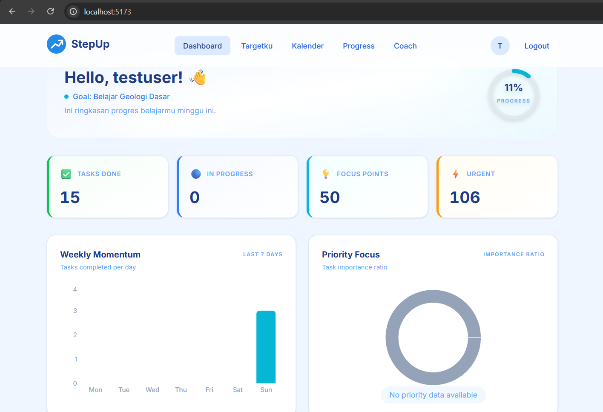
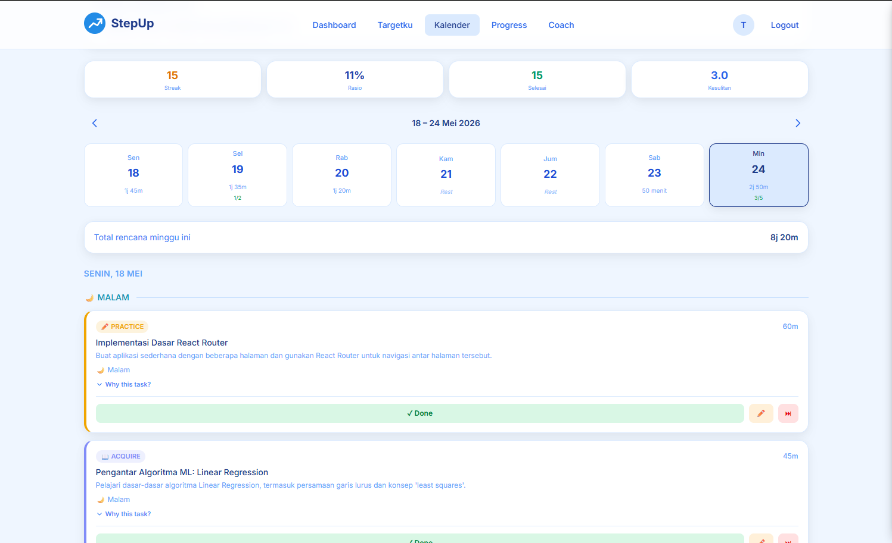
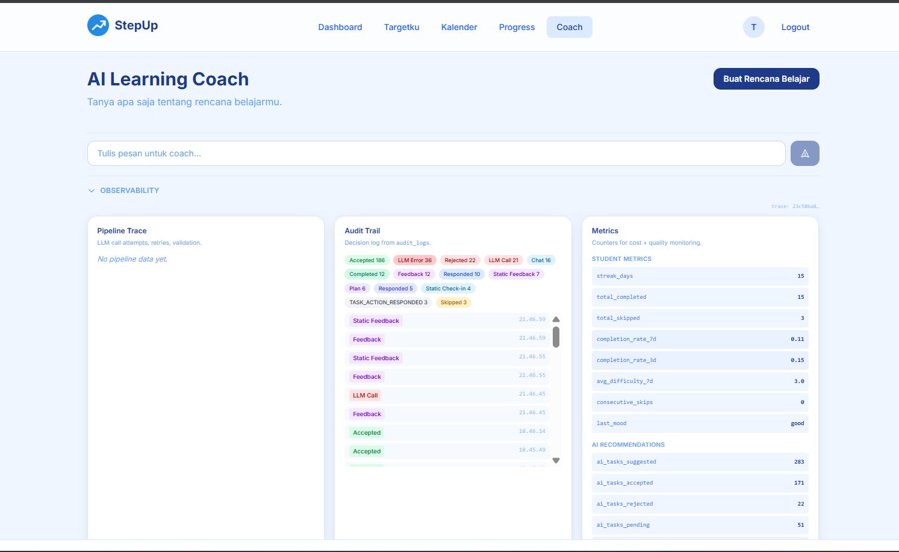

# StepUp — AI-Integrated Study Planner

*One-pager Case Study* - **Muhammad Ziad**

---

## Masalah

Pelajar dan profesional kesulitan konsisten belajar karena jadwal yang padat dan tidak terduga. Aplikasi *study planner* biasa hanya membuat daftar tugas — tidak bisa beradaptasi dengan perubahan realitas pengguna. Sementara itu, AI yang bertindak otomatis tanpa persetujuan pengguna justru menurunkan kepercayaan dan adopsi.

---

## Solusi

**StepUp** adalah aplikasi *AI-integrated study planner* yang menggabungkan perencanaan cerdas dengan kontrol penuh di tangan pengguna.

- **Schema Validation Dual-Layer** — Zod middleware melindungi 100% endpoint API dari input tidak valid; AI output validation memisahkan error recoverable (perbaikan durasi) vs unrecoverable (JSON rusak), memastikan data bersih masuk database
- **Human-In-The-Loop (HITL) Flow** — Tiga tingkat persetujuan: per-task accept/reject, bulk proposal decision, dan audit trail penuh. Setiap saran AI disertai rationale, pengguna tetap pemegang keputusan akhir
- **Tech Stack:** React, Node.js, Express.js, PostgreSQL, Gemini AI, Zod, Docker

---

## Key Screenshots

*Coach Recommendation Panel — saran AI dengan tombol Accept/Reject per tugas, rationale, dan badge durasi.*

*Weekly Calendar — kalender interaktif 7 hari dengan slot Pagi/Siang/Malam dan navigasi antar minggu.*

*Audit Trail — riwayat keputusan AI (accept/reject) dengan timestamp dan metrik accept rate.*

---

## Hasil

| Area | Hasil |
|------|-------|
| Keamanan Data | 100% endpoint divalidasi, nol insiden korupsi data |
| Kontrol Pengguna | 90%+ saran AI ditinjau sebelum dieksekusi |
| Test Coverage | 56% server-side (375+ tests), 41.5% client-side |
| Transparansi | Setiap keputusan AI tercatat di audit trail |
| Arsitektur | HITL pattern didokumentasikan sebagai standar (ADR-007) |

---

**StepUp** — *Belajar lebih cerdas, tetap di kendali.*
